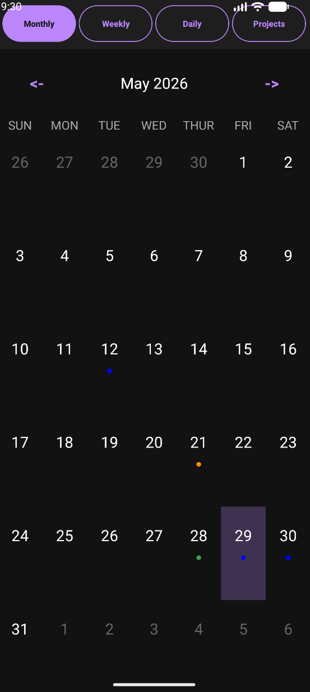
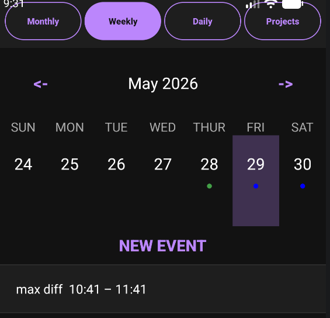
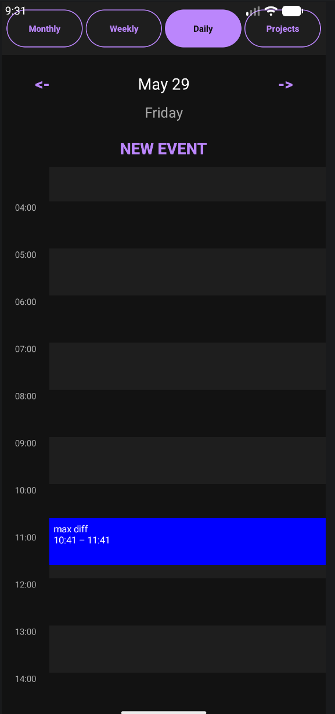
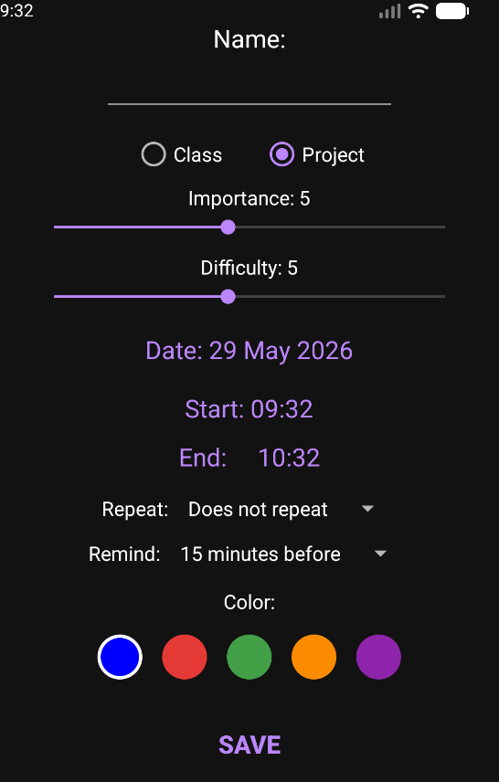
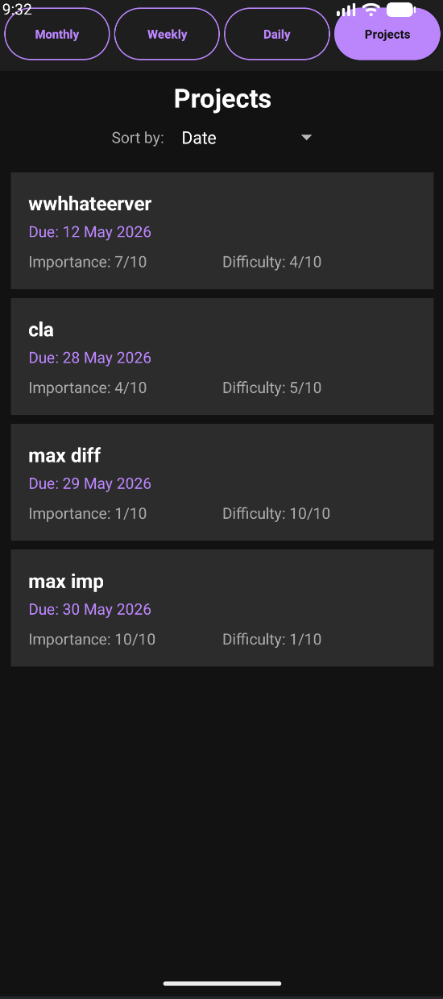

[README.md](https://github.com/user-attachments/files/28379205/README.md)
# Calendar & Project Planner — Android App

A full-featured personal calendar app built natively for Android, designed to help students manage both scheduled events and academic projects in one place.

---

## Features

### Calendar Views
- **Monthly view** — full month grid with event dot indicators
- **Weekly view** — week-at-a-glance with a scrollable event list for the selected day
- **Daily view** — time grid showing events spanning their exact start and end times

### Event Management
- Create, edit, and delete events
- Set a **date, start time, and end time**
- Choose from **5 colour labels** to categorise events visually
- Set **recurring events** — daily, weekly, monthly, or yearly with a custom interval
- Set **reminders** — at the time of the event or up to 1 day in advance
- Reminders fire as notifications and **survive device reboots**

### Project Tracking
- Mark any event as a **Project** instead of a Class
- Rate each project on **Importance (1–10)** and **Difficulty (1–10)**
- Dedicated **Projects tab** listing all upcoming projects sorted by:
  - Due date
  - Importance
  - Difficulty

### Design
- **Dark theme** throughout with a lavender accent colour
- **Pill-style navigation bar** on every screen with the active view highlighted
- Persistent navigation — jump between Monthly, Weekly, Daily, and Projects from anywhere in the app

---

## Screenshots

 

 

 
 
 
 
 
 
---

## Technical Overview

| Area | Detail |
|---|---|
| Language | Java |
| Min SDK | API 26 (Android 8.0) |
| Storage | JSON flat file via `FileWriter` / `FileReader` |
| Scheduling | `AlarmManager` with exact alarms |
| Boot persistence | `BroadcastReceiver` on `BOOT_COMPLETED` reschedules all alarms |
| UI | `RecyclerView`, `ListView`, custom adapters, `FrameLayout`-based time grid |

### Interesting implementation details

**Recurring events** — recurrence is not pre-expanded into individual records. Instead, `Event.occursOn(LocalDate)` computes on the fly whether a given date falls on the recurrence pattern using modular arithmetic on day/week/month/year offsets. This keeps storage minimal regardless of how far into the future you look.

**Alarm persistence across reboots** — Android cancels all `AlarmManager` alarms when the device powers off. `BootReceiver` listens for `BOOT_COMPLETED` and iterates every saved event to reschedule upcoming reminders, so notifications always fire even after a restart.

**Time grid rendering** — the daily view positions event blocks absolutely within a `FrameLayout` using pixel-scaled `topMargin` and height derived from event start/end times, giving true duration-spanning blocks. The hour background is drawn with a single `Canvas`-based view using alternating fill rectangles rather than individual divider `View` objects, which prevents sub-pixel flickering during hardware-accelerated scroll.

**Project ratings** — importance and difficulty are stored per-event but only surfaced in the UI when the event type is `PROJECT`. The projects list re-sorts in memory on spinner selection rather than re-querying storage, keeping the interaction instant.

---

## Tests

The project includes 14 unit tests that run on the JVM — no emulator required.

| File | What it covers |
|---|---|
| `EventOccurrenceTest` | `Event.occursOn()` — every recurrence type (none, daily, weekly, monthly, yearly) including interval variants and boundary conditions |
| `EventListTest` | The encapsulated event list API — add, get, set, remove, indexOf, clear, and the unmodifiable view returned by `getAll()`. Includes a regression test confirming that editing an event preserves its original ID |

**To run in Android Studio:** right-click `app/src/test/` → Run Tests

---

## Setup

1. Clone the repository
2. Open in **Android Studio**
3. Let Gradle sync
4. Run on a physical device or emulator running **Android 8.0+**

No API keys or external dependencies are required.

---

## Project Structure

```
app/src/main/java/com/example/calendar/
│
├── MainActivity.java           # Monthly calendar
├── WeekViewActivity.java       # Weekly calendar
├── DailyCalendarActivity.java  # Daily time grid
├── ProjectsActivity.java       # Projects list with sorting
├── EventEditActivity.java      # Create / edit events
│
├── Event.java                  # Data model + recurrence logic
├── EventType.java              # Enum: CLASS | PROJECT
├── RecurrenceType.java         # Enum: NONE | DAILY | WEEKLY | MONTHLY | YEARLY
├── EventStorage.java           # JSON persistence
│
├── CalendarAdapter.java        # RecyclerView adapter for calendar grids
├── EventAdapter.java           # ListView adapter for event lists
├── HourAdapter.java            # ListView adapter for hourly rows
│
├── AlarmReceiver.java          # Fires notification when reminder triggers
├── BootReceiver.java           # Reschedules alarms after device reboot
└── EventAlarmScheduler.java    # Schedules / cancels AlarmManager alarms
```

---

## Author
Ioannis Tzortzatos
Built as a personal portfolio project alongside a Unity game and SQL coursework.
